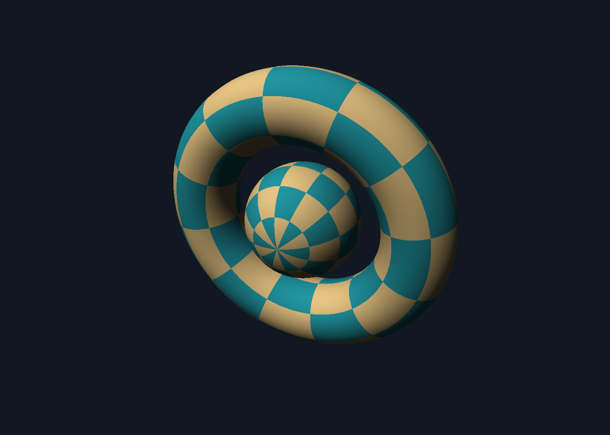
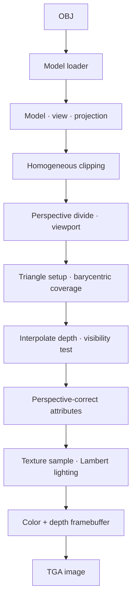
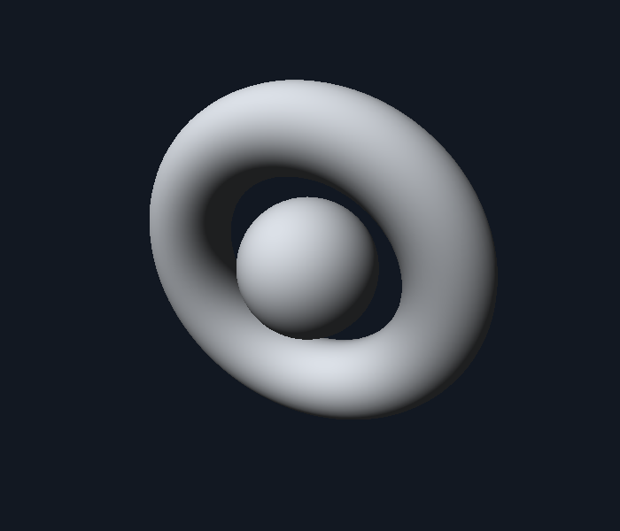
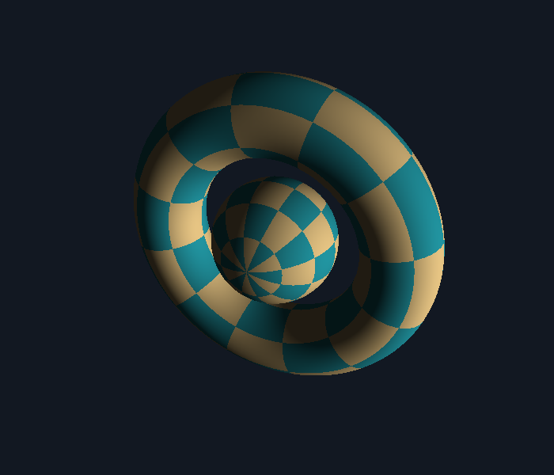

# Software Renderer

**Runs entirely on the CPU.**

[](https://github.com/Speed126/Software-Renderer/actions/workflows/ci.yml)




A C++20 rasterizer that loads an OBJ, projects its triangles, shades the
visible pixels, and writes a TGA image. Includes edge tests, depth comparisons, matrix math, clipping, and attribute interpolation.

## How to Use

Requires **CMake 3.20+** and a C++20 compiler. No runtime libraries beyond the
C++ standard library. The framebuffer is saved by a small uncompressed TGA writer.

```sh
cmake -S . -B build -DCMAKE_BUILD_TYPE=Release
cmake --build build --config Release --parallel
ctest --test-dir build -C Release --output-on-failure
```

From the repository root, with a single-configuration generator (Linux, macOS,
or MinGW):

```sh
./build/renderer assets/orbital.obj --output output.tga --width 1400 --height 1000
```

With the Visual Studio generator, in PowerShell:

```powershell
.\build\Release\renderer.exe assets/orbital.obj --output output.tga --width 1400 --height 1000
```

Running with no arguments uses `assets/orbital.obj` and writes an 800×800
`output.tga`. Paths are relative to your working directory. CMake also copies
the demo into `build/assets`, so running from the build directory works.

## What It Does

- Bounding-box traversal with pixel-center barycentrics and shared-edge rules.
- Per-pixel float depth buffer and optional counterclockwise back-face culling.
- Model fitting/rotation, look-at camera, perspective and six-plane clipping.
- Triangulated OBJ meshes with positions, UVs, normals, and positive or negative indices.
- Perspective-correct UV/normal interpolation and directional Lambert lighting.
- Procedural checker or a supplied P3 PPM texture; nearest sampling with repeat.
- Tests run through CTest, with CI on Linux and Windows.



## Useful Arguments

```sh
./build/renderer path/to/model.obj --texture path/to/texture.ppm --output render.tga
./build/renderer --rotate 30 --eye 0.5 0.25 3.6
./build/renderer --solid --light -0.4 0.7 1
./build/renderer --no-cull
```

| Option | Meaning |
|---|---|
| `--output path` | TGA destination; the parent directory must exist |
| `--width N`, `--height N` | Integer dimensions from 1 to 4096; default 800 |
| `--eye X Y Z` | Camera position in fitted model coordinates; looks at the origin |
| `--rotate degrees` | Rotate the fitted model around Y |
| `--light X Y Z` | World-space direction **toward** the light; normalized internally |
| `--texture path.ppm` | Use an ASCII P3 PPM image instead of the checker |
| `--solid` | Use a neutral solid surface instead of a texture |
| `--no-cull` | Draw both windings; useful for inspecting open meshes |
| `--help` | Show usage |

Invalid arguments and failed reads/writes exit with code 1.

## Inside a Triangle

[`rasterizer.cpp`](src/rasterizer.cpp) evaluates signed edge functions inside a
triangle's screen-space bounding box. Their ratios to the total area give the
three barycentric weights. Those weights locate the sample within the triangle
and interpolate its depth and surface attributes. Pixel centers avoid a corner
sampling bias; a half-open edge convention gives adjacent triangles consistent
ownership of their shared boundary. Degenerate and nonfinite triangles are
skipped, and traversal is clamped before converting bounds to integers.

The depth buffer starts at infinity. A fragment updates the color and depth only
when its depth is smaller than the stored value. Hidden surfaces therefore stay
hidden when triangle order changes. Exactly equal depths keep the first sample.

## Camera and Surface Detail

[`pipeline.cpp`](src/pipeline.cpp) centers the model bounds and uniformly scales
the longest extent to two units. Models can arrive with different sizes and
origins. Matrices use row-major storage with column vectors:
`projection * view * model * position`. The camera is right-handed, looks down
view-space −Z, and uses a 45° vertical field of view. Near/far planes are 0.1/100.
Clipping happens before division by `w`, including triangles crossing the camera
or near plane. Screen coordinates use a bottom-left origin; TGA rows are written
with a top-left origin.

For an attribute `a`, interpolation uses
`sum(barycentric[i] * a[i] / w[i]) / sum(barycentric[i] / w[i])`.
This keeps textures attached to surfaces as they recede into the
image. NDC depth stays affine in screen space. Interpolated normals are
renormalized for Lambert shading, with a small ambient floor so unlit surfaces
remain readable. The model transform uses uniform scale, so rotating normals
is sufficient.

| Solid Surface | Textured + Alternate Light |
|---|---|
|  |  |

These images are direct renderer output converted to PNG.
To reproduce the documentation images with an existing Python/Pillow setup:

Linux/macOS/MinGW:

```sh
python tools/render_docs.py build/renderer
```

Visual Studio:

```powershell
python tools/render_docs.py build/Release/renderer.exe
```

Pillow is only a documentation convenience; it is not a build or renderer dependency.

## Tests and Codebase

```sh
cmake -S . -B build -DRENDERER_STRICT=ON
cmake --build build --config Release --parallel
ctest --test-dir build -C Release --output-on-failure
```

The 15 CTest entries cover math, OBJ failures, shared edges, clipping,
perspective-correct texture interpolation, depth/order invariance, fitted transforms, complete
TGA output and CLI diagnostics. Checks run in Release builds too. The
[workflow](.github/workflows/ci.yml) builds and tests on Ubuntu and Windows,
with a separate Ubuntu Clang ASan/UBSan job. All three jobs currently pass.

| Location | Responsibility |
|---|---|
| `include/renderer/`, `src/` | Math, loading, pipeline, rasterizer, texture and framebuffer |
| `src/main.cpp` | Argument handling and the offline render operation |
| `tests/` | Small C++ test executables and CMake CLI checks |
| `assets/`, `tools/` | Original demo and optional reproduction scripts |
| `src/tga_writer.cpp` | Uncompressed 24-bit TGA output using the standard library |

## License

Project code, the procedural model and documentation are [MIT licensed](LICENSE).
